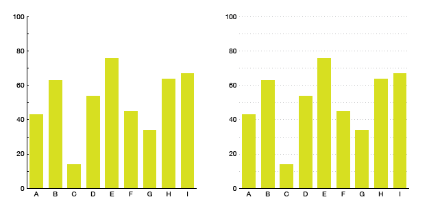

# Using full-width grid or tick lines

Use full-width lines with your tick marks when **specific numbers are really important.**

If your reader only needs to know that **A** is bigger than **B**, don't use full-width lines, just use small ticks on the axis. If your reader is going to spend some time with the graphic and be interested that A is **45.65** and B is **37.66**, that's when you use full-width lines.

**Caveat:** A lot of house styles use full-width marks for scatterplots, no matter what's important. It's pretty reasonable - when you're trying to read two axes at the same time to figure out where a point lies, full-width lines can really help with that.