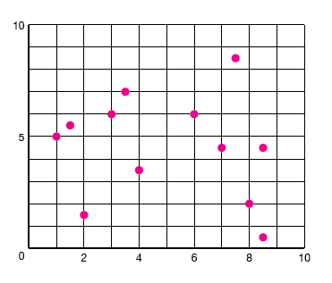
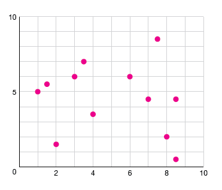

# Backgrounding grid or tick lines

If you're using full-width grid/tick lines, you need to make them **much less obvious than the dots, bars or lines** that are your actual data points. I call this "backgrounding."

The rule boils down to **don't make them black lines**.

If your background is white(-ish), you should **make the lines grey**.

You could also make the lines light grey and **dotted or dashed**.

## Negative space grid

You can also make your **graph background grey**, and make your grid lines **white** so they're kind of using negative space - or **a slightly darker grey** because obviously everything ever should be grey.

You can still dot them if you'd like!

