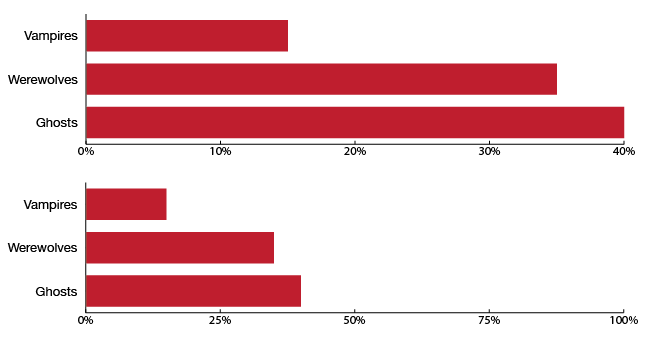

# Selecting an upper bound

One of the aspects of your story that's reflected in your axis bounds is **whether the values on the graph are only relative to one another, or are the value also relative to a maximum?**

If you're only comparing the values to one another, use the maximum value in your data set as the upper bound of the axis. If you're comparing the values to some hypothetical maximum value, you can use that maximum instead.

## Example

If we ask what people have nightmares about, we might just want to compare different Scary Things to see which one people fear the most (top figure). We could also present those same values against 100%, as we do in the bottom figure. The values can still be compared to one another, but we can also see how close we are to complete Ghost-fear saturation (we're getting there!).