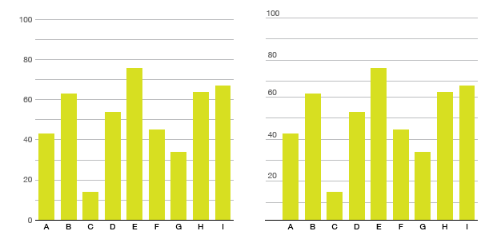

# Placing your annotations

While the standard place for y-axis tick labels is to the left of the line, you can also **put them on top!**

Only do this if you have full-width tick lines - short ones usually won't work out.

It can help pull a graphic into seeming like a single unit, instead of having the text float off in space to the left. I **think** this is probably more of a style decision rather than a good vs. evil decision.