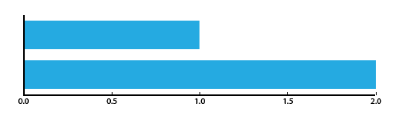

# Removing borders on bars

Make sure your bars and columns are solid colors that don't have outlines around them.

If you happen to have a bar that's the same color as your background, just change one of the colors.

## Example

Here's an example from Adobe Illustrator - the default graph has a solid border around each bar.

The borders are supposed to help you... I don't know, tell the bars apart? The bars are separated by space, though, so you can tell they're different regardless.

So I went ahead and set the `Stroke` to zero, and voila! A much nicer, more modern chart.

The simple bars might clash a little with the current axes, but it's a good start towards cleaing up the defaults.