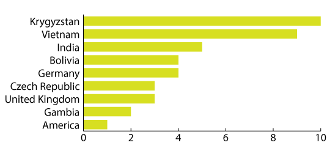
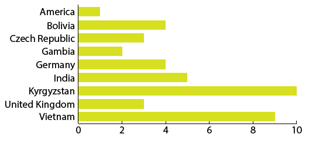

# Ordering bars

You should **always order your bars and columns.**

Most of the time you should be ordering your bars from **largest to smallest, not alphabetically**. We're designing for the most popular use case: **some people** are interested in finding one specific bar, but **everyone** is interested in knowing what the **largest and smallest bars are**.

## Example

We start with a series of countries, all with some sort of values.

Then we'll go ahead and order them **by bar size, not alphabetically**.

Some people might want to put things in alphabetical order, but if you're really interested in Bolivia you're probably more interested in *how it stands relative to everyone else*, not just *what the actual number is*.

Now that it's ordered you can easily see that Krygyzstan and Vietnam are on top and the US is on the bottom. How interesting!

And Bolivia? Well, you can read through the country names and find it easily enough. Because it's ordered by bar size you can easily see that Bolivia is a little above the halfway point compared to the other countries. If we ordered the graphic alphabetically you'd find Bolivia quickly but would only learn that its value is 4.

If you don't believe me, here's what it would look like:

