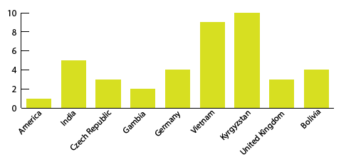

# Don't use diagonal labels

Sometimes you're labeling columns and the names of the labels are just **too long**, so you get fancy and make them diagonal.

**Do not get fancy.** Just make the chart use **horizontal bars instead of vertical ones**, then you can write out the labels in normal, readable, left-to-right fashion.

## Example

Country names are notorious for this situation - you usually have a lot of countries and some of them have very long names.

If you turn it into a horizontal bar graph instead of a vertical bar graph, all your problems quickly disappear.

