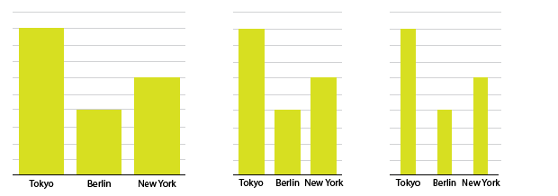

# Thinning out columns

Wide bars and columns look clunky - **keep your bars thin** for a simpler, more elegant look. Too thin, though, and it's tough to compare the bars to one another.

The right width often has to do with spacing and general graph setup. Also, it's usually easy to have thin **bars** as opposed to thin **columns**.