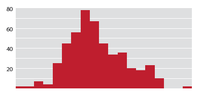

# Extra-wide, 100% columns

If you're making a bar graph of values that are one right after the other - a histogram, for example - you can make each bar **so wide it touches the bars on either side**. This helps convey the idea that there is nothing between one data point and the next.

Some people probably think this is a terrible idea, and it might be.

These are called **100% columns** because they take up 100% of the space that they could possibly take up. 

## Comparison with area charts

Graphs with 100% columns are basically area charts, just using columns to fill in the space instead of colored-below lines.

If you could make a line graph of your data but want to go for bars instead, 100% columns are for you.