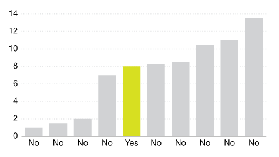

# Make unimportant things grey

Grey is a very useful color for things that aren't very important. Use grey to color elements...

* that are unselected or backgrounded
* elements that provide context to an important data point
* that are not the currently selected element

In fact, let's just make **grey the default color**. everything should be grey unless you'd feel comfortable shouting that data point out at a stranger.

If you're using hex, `#e1e1e1` and `#f3f3f3` are two nice light greys that I'm personally fond of.

## Example

You have a line graph of life expectancy over time for 20 different countries. You're currently interested in India.

Make the 19 countries that *aren't* India grey, and then India gets to be red or green or whatever your favorite highlight color is.