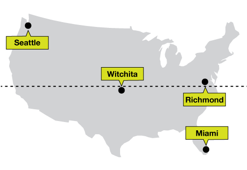

# Tooltip directions

If you have a tooltip that always shows up above your data point, or is especially wide, you might have issues with the tooltip **running off the side of the screen**.

A quick fix is to **change the direction of the tooltip based on where the data point is**: if the data point is on the top half of the visualization, put the tooltip below the data point. If the data point is on the bottom half, put the tooltip above the data point. That way there'll always be enough space.

You can do the same thing with left/right if you need to.