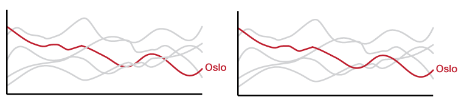

# Layering lines

When you have a complex line graph and you're highlighting one of the lines, **bring that line to the front** so none of the non-highlighted lines cross over it. It an important line (right?) and shouldn't be obstructed.

If you're using d3, you're looking for [`raise`](https://github.com/d3/d3-selection#selection_raise).