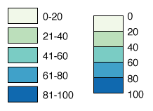

# Marking boundaries instead of ranges

When building a legend that explains the difference between several colors, you can sometimes remove much of your text by **marking boundaries instead of full ranges**.

Instead of ranges like "0-20" and "21-40," we're just going to mark the **boundaries** between the colors. This lets us remove a lot of repetitive text and to merge the boxes together so the legend takes up less space.