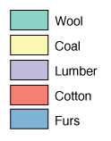

# Horizontal vs vertical orientation

For numeric scales, a **horizontal legend** typically scans more easily than a vertical one.

For scales with categories, though, a **vertical scale** is usually better. With all of the space to the right you're able to write long long text next to each box.

