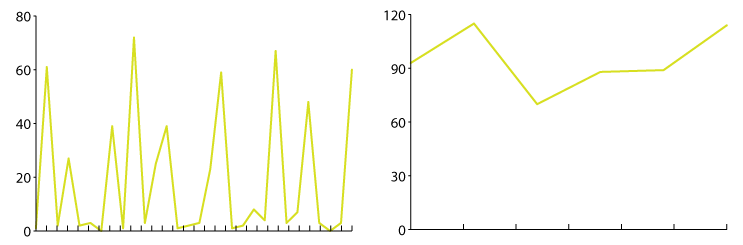

# Smoothing out jagged lines

If you're graphing something over time and the lines are jumping up and down a lot, **you should try resampling the data across a larger range,** for example using weeks instead of days. No one can read a jagged line, and if they can they don't enjoy doing it!

If you can't combine the individual data points, it might be best to use bars instead of lines.

## Example

For example, let's say I'm graphing **the money I spend on groceries every day.** Since I don't grocery shop every day, the line is going to be very very erratic - usually $0, but sometimes it will jump up to $20 or even $150. If I graphed my grocery spending on a weekly or monthly basis, though, it would even the line out.

Even though the original daily graph has **more raw information**, the way it's presented **made the graph less informative**.