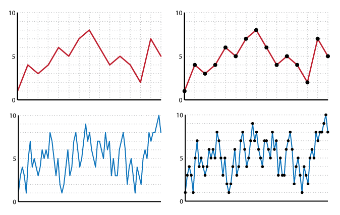

# Plotting dots on your lines

Only use dots on your lines **when each specific data point is important**. Otherwise they're just clutter - if you have a lot of data or are just interested in general trends, the lines are usually enough by themselves.

As you can see, **more data = less clean**.

If you're on the fence about whether to **dot or not**, read [about backgrounding on line graphs](#user-content-backgrounding-data-dots-on-lines) for tips on how to use dots but make them subtle enough to get the best of both worlds.