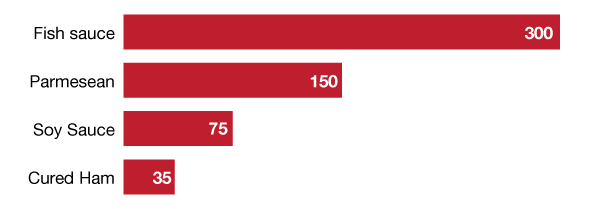
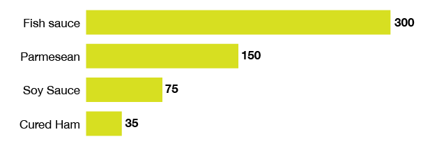

# Directly labeling your data points

Instead of having a key to understand a color or making your user rely on an axis to understand a value, sometimes you can just **write the value next to or inside the circle/bar/whatever**.

You usually only use this with smaller data sets and/or with smaller numbers - preferably rounded integers. Having to write out something like **34,520** clutters your graph up quickly.

## Labeling on the outside

Labeling on the inside in a contrasting color is a fun trick, but you can also label on the outside.

It's especially useful when you need to include units that take up a lot of room, such as "million" or "pounds per year."

## Example

For example, you have a bar representing Peru's GDP in 2013. You could have your reader slowly trace a line from the end of the bar down to the axis and estimate that it's *kind of a little above 200 billion*, or you could just **write 202.3 billion at the end of the bar**.