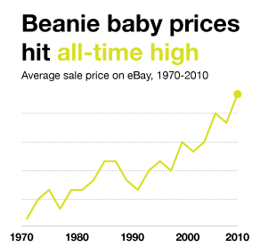

# Giving your visualization a title

**Most graphics deserve a title**. That way when they're cool and popular and being sent around the internet everyone will know just what they're looking at.

Your title should usually be **what you want the person to take away from the graphic** (the meaningful or interesting part) **not** just a description of what the data is (the boring part).

If you need to explain what the data is, you can use a subtitle.

## Example

If you're visualizing [how expensive Christmas dinner is](http://www.bbc.com/news/uk-england-38051644) you might make a graph of the cost of Christmas dinner each year.

You might title that **Christmas Dinner Costs Each Year 2011-2016 (£)**.

Then your editor will change it to **Christmas Dinner Costs Rising** instead, and she will be correct.

## Interesting data sets

**If your data set is actually interesting** you can use a description of the data as your title.

If you mapped every single step you've taken in the past five years, that's pretty interesting: **every single step I've taken in the past five years** is a fine title.