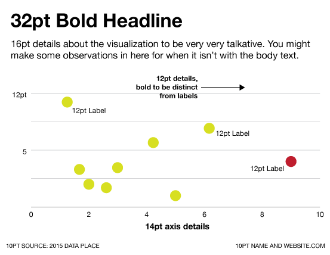
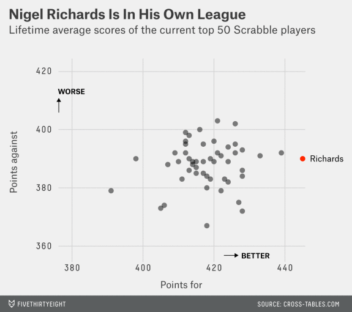

# Standardizing your font sizes

Don't have more than **two or three font sizes** in the main body of your graphic. Generally you can solve this problem by making sure your annotations the same size as your axis labels.

**Titles and subtitles don't count towards the number**, only axes, labels, annotations, and anything else that's the actual "visualization". 

## Example

When you're playing around with a new design, it's easy to accidentally end up with

* **42pt title**, to make it nice and big
* **16pt description**, to make it easy to read
* **12pt anotations**, to fit everything in
* **12pt bold annotations**, for the more important annotations
* **10pt axis labels**, since they're less important
* **8pt tick mark labels**, since there are like ten of them and you want them to be really small

**That is probably too much stuff.** Make the annotations and everything on the axes the same size, and use color or positioning to emphasize the annotations vs. the labels.

## Out in the wild

Take this FiveThirtyEight graphics from [a piece on Scrabble champ Nigel Richards](http://fivethirtyeight.com/features/what-makes-nigel-richards-the-best-scrabble-player-on-earth/).

Between different fonts sizes, weights (boldness), and typefaces this graphic has at least **six different kinds of text there.** They can get away with it because they're FiveThirtyEight - you probably aren't, so stay safe and standardize.