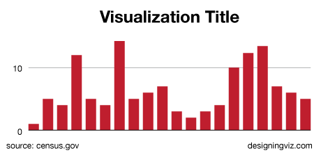

# Taking credit

You should **always put contact information on your graphics.**

Usually your name, website, and Twitter handle are the maximum you can fit in. The traditional position for it is in the bottom right-hand corner (your data citation will be on the bottom left), or you can get a little bolder and put it right under the title.

There's also a tendency to put the credit and source lines in ALL CAPS which is super fine.